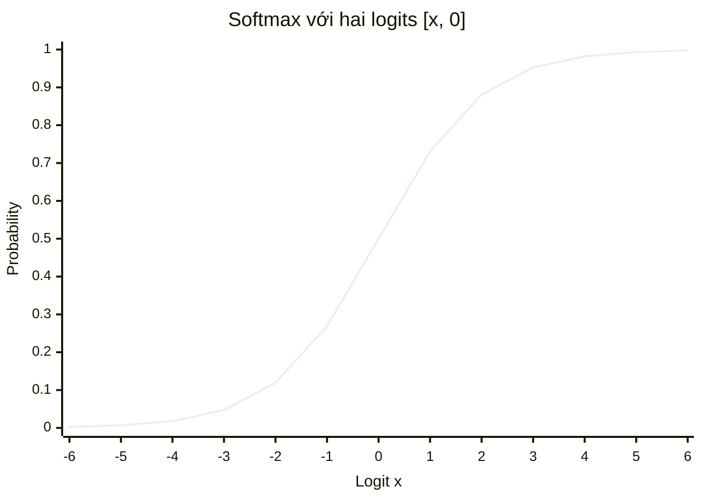

## Self Attention
### Self Attention là gì ?
* Là một cơ chế cho phép mỗi token trong một chuỗi xem xét mọi token khác trong cùng chuỗi đó, bao gồm cả chính nó, để hiểu ngữ cảnh
* Từ "Attention" có nghĩa là mỗi token tự quyết định mức độ tập trung của mình vào các token khác
* Vì vậy, mỗi từ trong câu đều xem xét mọi từ khác trong cùng câu đó và tìm ra những từ nào quan trọng nhất đối với ý nghĩa của nó
* Ví dụ: Câu : "The animal did not cross the street because it was too tired."
  * Vậy câu hỏi đặt ra là: từ này `it` ám chỉ điều gì?
  * Ta thừa biết nó ám chỉ `the animal`
  * Vậy còn câu: "The animal did not cross the street because it was too wide."
  * Cùng 1 cấu trúc câu nhưng `it` ở 2 câu lại có ý nghĩa hoàn toàn khác nhau
  * Não bộ của chúng ta làm thế nào để hiểu được 2 ngữ cảnh đó ? Chúng ta sẽ xem xét các từ xung quanh từ `it`, từ đó, từ `tired` thu hút sự chú ý của chúng ta về phía từ `the animal`, còn `wide` thu hút chúng ta về từ `the street`
  * Đây chính xác là những gì xảy ra bên trong LLMs, mỗi từ đều xem xét mọi từ khác trong cùng 1 câu để hiểu nghĩa của nó. Mô hình này dành nhiều sự chú ý hơn cho những từ quan trọng và ít chú ý hơn với những từ không quan trọng
  * Nếu thiếu đi sự "Self-Attention" trong 1 câu, từ ngữ `it` sẽ chỉ là một từ chung chung, không có ý nghĩa thực sự

#### Các vector Query, Key, Value
* Với mỗi token, self-attention cần trả lời 2 câu hỏi:
  * Những từ khóa nào khác trong câu này quan trọng đối với tôi?
  * Tôi nên tập trung vào từng khía cạnh đến mức độ nào?
* Để trả lời những câu hỏi này, chúng ta tạo ra ba vectơ cho mỗi mã thông báo đầu vào:
  * **Query vector**: token này đang tìm kiếm điều gì.
  * **Key vector**: những gì mã thông báo này cung cấp cho người khác.
  * **Value vector**: thông tin thực tế mà mã thông báo này mang theo.
* Từ "Self" trong cụm từ "Self Attention" xuất phát từ một sự thật rất quan trọng: 
  ```text
    Truy vấn (Q), Khóa (K) và Giá trị (V) đều xuất phát từ CÙNG một chuỗi đầu vào.
  ```
* Đây chính là điều làm nên sự "Tự" chú ý. Cùng một chuỗi tạo ra các câu hỏi, cùng một chuỗi tạo ra các đáp án để khớp với những câu hỏi đó, và cùng một chuỗi cung cấp các giá trị. Chuỗi đó đang tự chú ý đến chính nó.
* Nói một cách đơn giản, nếu câu đầu vào của chúng ta là "Con vật không băng qua đường", thì Q, K và V đều được suy ra từ chính câu "Con vật không băng qua đường".

### Step-by-step xây dựng 1 cơ chế Self Attention
* **Bước 1**: Bắt đầu với các vector embedding (nhúng) đầu vào. Mỗi token trong câu được chuyển đổi thành một vector. (output1)</br></br>
* **Bước 2**: Tạo ra ba vectơ cho mỗi token bằng cách nhân ma trận nhúng (output1) với ba ma trận trọng số khác nhau:
  * Q = $X * W_Q$
  * K = $X * W_K$
  * V = $X * W_V$
  * Ở đây, $W_Q$, $W_K$, và $W_V$ là các ma trận trọng số mà mô hình học được trong quá trình huấn luyện.</br></br>
* **Bước 3**: Tính tích vô hướng của Q với ma trận chuyển vị của K. Đây là phép nhân ma trận cho ra điểm số chú ý. Chúng ta sử dụng ma trận chuyển vị để các hình dạng được căn chỉnh chính xác cho phép nhân.
  * scaled_score = $\frac{Q.K^T}{\sqrt{d_k}}$ (nhân vô hướng thì cho ra 1 số)
  * Điểm số cho ta biết mức độ tương tác giữa hai token. Điểm số càng cao nghĩa là sự trùng khớp càng mạnh giữa truy vấn của token này và khóa của token kia 
  * Việc điều chỉnh tỷ lệ này được thực hiện để giữ cho các số nằm trong phạm vi ổn định, tránh việc hàm softmax tạo ra các giá trị cực đoan. Nếu không có sự điều chỉnh tỷ lệ này, độ dốc có thể trở nên rất nhỏ trong quá trình huấn luyện</br></br>
* **Bước 4**: Áp dụng hàm softmax lên các điểm số đã được hiệu chỉnh. Điều này chuyển đổi các điểm số thành xác suất. Tổng của mỗi hàng trong ma trận lúc này bằng 1.
  * Hàm softmax: 
```math
  \hat{y}_j = \text{softmax}(z)_j = \frac{e^{z_j}}{\sum_{k=0}^{1} e^{z_k}} 
  ```
  * Attentions Weights = softmax(scaled_score) = $softmax(\frac{Q.K^T}{\sqrt{d_k}})$
  * Các trọng số này cho chúng ta biết, đối với mỗi token, nó nên dành bao nhiêu sự chú ý cho mỗi token khác.</br></br>
* **Bước 5**: Nhân các `attention weights` với ma trận Giá trị V. Điều này cho ra kết quả đầu ra cuối cùng.
  * output = $softmax(\frac{Q.K^T}{\sqrt{d_k}}) * V$
  * Kết quả đầu ra là một biểu diễn mới của mỗi token, trong đó ý nghĩa của token được làm phong phú thêm bởi ngữ cảnh của các token khác

### Vì sao Self-Attention lại hiệu quả đến vậy
* Trước khi có cơ chế Tự Chú Ý (Self Attention), các mô hình như RNN và LSTM xử lý từng token một trong một chuỗi. Điều này rất chậm và làm suy yếu mối liên kết giữa các từ cách xa nhau. Cơ chế Tự Chú Ý đã giải quyết cả hai vấn đề này.
  * Song song hóa: Tất cả các token được xử lý cùng một lúc. Chúng ta không cần phải chờ một token hoàn thành trước khi xử lý token tiếp theo. Điều này giúp quá trình huấn luyện trên GPU diễn ra rất nhanh.
  * Phụ thuộc tầm xa: Mỗi token có thể trực tiếp tham chiếu đến mọi token khác, ngay cả khi chúng cách nhau rất xa trong câu. Không có sự suy giảm theo khoảng cách.
  * Hiểu theo ngữ cảnh: Mỗi từ vựng sẽ có ý nghĩa phong phú hơn dựa trên các từ xung quanh. Cùng một từ có thể có cách diễn đạt khác nhau trong các câu khác nhau tùy thuộc vào ngữ cảnh.
  * Tính linh hoạt: Cơ chế Tự chú ý không quan tâm đến thứ tự tính toán. Nó có thể xử lý các chuỗi dài và nắm bắt các mối quan hệ phức tạp.


## Toán học đằng sau Attention - Q,K,V
### Công thức của Attention
* Ta có công thức sau: $${\displaystyle \text{Attention}(Q,K,V) = \text{softmax}\left(\frac{QK^T}{\sqrt{d_k}}\right)V}$$
* Ở đây:
  * Q là ma trận truy vấn (Query)
  * K là ma trận khóa (Key)
  * V là ma trận giá trị (Value)
  * $K^T$ là ma trận chuyển vị của K
  * $d_k$ là chiều (dim) của vector khóa (Key)</br></br>
* Ý tưởng rất đơn giản: chúng ta so sánh những gì mỗi từ đang tìm kiếm ( Truy vấn ) với những gì mà mọi từ khác cung cấp ( Từ khóa ), và sau đó sử dụng những so sánh đó để thu thập thông tin thực tế ( Giá trị ) từ những từ có liên quan nhất

### Cơ sở toán học đằng sau tỉ lệ $\sqrt{d_k}$ trong công thức Attention

#### Diễn giải ban đầu
* Đầu tiên xét công thức của hàm Softmax: 
```math
\hat{y}_j = \text{softmax}(z)_j = \frac{e^{z_j}}{\sum_{k=0}^{1} e^{z_k}} 
```
* Đồ thị của hàm này với 2 chiều như sau:

* Khi 1 giá trị đi qua hàm này, output sẽ là một xác suất trong khoảng từ 0 đến 1. Khi giá trị logit tăng lên, xác suất cũng tăng theo. Khi giá trị logit giảm xuống, xác suất giảm theo. Khi giá trị logit bằng 0, xác suất là 0.5.
* Giả sử chúng ta bỏ qua bước chia tỷ lệ và tính toán sự chú ý trực tiếp như sau: $$Attention = softmax(Q.K^T)V$$
* Ta biết rằng tích vô hướng của 2 vector sẽ cho ra 1 giá trị bằng các phép cộng liên tục. Suy ra, khi số chiều của vector tăng lên, mà thật ra trong các mô hình Transformer thực tế, $d_{model}$ rơi vào khoảng `64.128`, hoặc thậm chí lớn hơn
* Suy ra khi số chiều tăng lên, tích vô hướng của 2 vector sẽ có xu hướng lớn hơn
* Để ý đồ thị của hàm softmax, khi giá trị logit tăng lên, xác suất sẽ tiến gần đến 1, hoặc khi logit càng nhỏ thì xác suất sẽ dần về 0
* Một token sẽ nhận được gần như toàn bộ sự chú ý (gần 1.0), và tất cả các token khác hầu như không nhận được sự chú ý nào (gần 0.0). Mô hình ngừng phân bổ sự chú ý cho nhiều từ có liên quan. Nó trở nên quá tự tin về một từ duy nhất
* Đây là một vấn đề lớn vì:
  * Mô hình không thể học từ nhiều từ cùng một lúc
  * Gradient (các tín hiệu được sử dụng để cập nhật mô hình trong quá trình huấn luyện) trở nên cực kỳ nhỏ, gần như bằng không. Đây được gọi là vấn đề Gradient biến mất
  * Khi Gradient quá nhỏ, mô hình sẽ ngừng học một cách hiệu quả
* Vậy nên, việc điều chỉnh tỷ lệ xuất hiện $\sqrt{d_k}$ để giải cứu tình huống

#### Nhưng tại sao tích vô hướng lại tăng khi $d_k$ tăng
* Tích vô hướng của hai vectơ được tính bằng cách nhân từng cặp phần tử rồi cộng tất cả các kết quả lại với nhau
* Giả sử ta có hai vectơ $q$ và $k$, mỗi vectơ có kích thước $d_k$, công thức tính Tích vô hướng sẽ như sau: $$q \cdot k = q_1k_1 + q_2k_2 + ...+ q_{d_k}k_{d_k}$$
* Mỗi số hạng $q_i.k_i$ là một số. Nó có thể là số dương hoặc số âm. Khi cộng ngày càng nhiều số này lại với nhau, chúng không phải lúc nào cũng triệt tiêu hoàn toàn
* Nhưng nhìn chung tổng có xu hướng tăng lên về độ lớn. Càng nhiều chiều, chúng ta càng thêm nhiều số hạng, và tích vô hướng càng lớn
* Tích vô hướng tăng theo $d_k$. Đây là vấn đề cốt lõi. Kích thước càng lớn, tích vô hướng càng lớn, và hàm softmax hoạt động càng kém hiệu quả

#### Khái niệm phương sai của tích vô hướng
* Phương sai (*variance*) cho biết một tập hợp các giá trị có thể phân tán như thế nào so với giá trị trung bình. Phương sai cao có nghĩa là các giá trị cách xa giá trị trung bình. Phương sai thấp có nghĩa là các giá trị gần với giá trị trung bình
* Công thức phương sai như sau: $$\sigma^2 = \frac{1}{n}\sum_{i=1}^{n}(x_i-\bar{x})^2$$
* Có một chứng minh khá dài dòng, không tiện viết ở đây nhưng ta sẽ có: $$Variance(q \cdot k) = d_k$$

#### Ảnh hưởng của Tích Vô Hướng tới hàm Softmax
* Từ công thức softmax ở trên, ta thấy rằng: $e^x$ tăng trưởng cực kỳ nhanh khi $x$ tăng lên
* Giả sử chúng ta có ba điểm số chú ý: `[50, 10, 5]`. Khi ta áp dụng hàm softmax:
    ```
    e^50 = 5,184,705,528,587,072,045
    e^10 = 22,026
    e^5  = 148
  
    softmax = [5,184,705,528,587,072,045 / total, 22,026 / total, 148 / total]
    ```
* Giá trị đầu tiên chiếm ưu thế hoàn toàn. Kết quả đầu ra của hàm softmax sẽ xấp xỉ `[1.0, 0.0, 0.0]`
* Bây giờ, hãy so sánh điều này với các điểm số nhỏ hơn: `[5, 1, 0.5]`. Khi chúng ta áp dụng hàm softmax:
    ```
    e^5 = 148.413
    e^1 = 2.718
    e^0.5 = 1.649
    Sum = 152,780
    softmax = [148.413 / Sum, 2.718 / Sum, 1.649 / Sum]
            = [0.971, 0.018, 0.011]
    ```
* Có thể thấy rằng ngay cả với điểm số nhỏ hơn, giá trị đầu tiên vẫn nhận được nhiều sự chú ý nhất. Nhưng các giá trị khác không hoàn toàn bằng không. Mô hình vẫn có thể học hỏi từ tất cả các vị trí
* Khi $d_k$ kích thước lớn và chúng ta không điều chỉnh tỷ lệ, điểm số tích vô hướng trở nên quá lớn đến nỗi đầu ra của hàm softmax gần như trở thành hàm `one-hot`. `One-hot` nghĩa là một giá trị bằng `1.0` và các giá trị còn lại bằng `0.0`. Mô hình hoạt động như thể chỉ có một từ quan trọng và bỏ qua mọi thứ khác. Gradient biến mất và quá trình học dừng lại

#### Tại sao $\sqrt{d_k}$ là hệ số tỉ lệ phù hợp?
* Đã hiểu rõ vấn đề, giải pháp trở nên rõ ràng. Chúng ta cần giữ cho giá trị tích vô hướng đủ nhỏ để hàm softmax có thể tạo ra các trọng số chú ý được phân bổ tốt
* Cần đưa phương sai của tích vô hướng trở lại bằng 1, bất kể giá trị $d_k$ lớn đến mức nào
* Nếu ta chia tích vô hướng cho một hằng số nào đó c, phương sai sẽ trở thành: 
  $$Variance(\frac{q \cdot k}{c}) = \frac{1}{c^2}Variance(q \cdot k) = \frac{d_k}{c^2}$$
* Ta muốn phương sai này bằng 1 để giá trị tích vô hướng nằm trong phạm vi có thể quản lý được. Vì vậy, ta đặt:
  $$\frac{d_k}{c^2} = 1 \Rightarrow c = \sqrt{d_k}$$
* Đây là lý do tại sao chúng ta chia cho $\sqrt{d_k}$. Chính giá trị này sẽ đưa phương sai trở lại bằng 1
* Hãy làm 1 ví dụ cho nó trực quan:
  * Giả sử $d_k = 64$, ta có 3 token với score tích vô hướng như sau : `[14, 10, 12]`
  * Không cần chia $\sqrt{d_k}$:
    ```
    e^14 = 1,202,604
    e^10 = 22,026
    e^12 = 162,755
    
    Sum = 1,387,386
    
    softmax = [0.867, 0.016, 0.117]
    ```
  * Ở đây, token đầu tiên nhận được 86,7% sự chú ý. Từ thứ hai chỉ nhận được 1,6%. Sự phân bố này khá cực đoan mặc dù điểm số thô (14, 10, 12) không chênh lệch nhau quá nhiều
  * Hãy chia nó cho $\sqrt{64}$ tức là chia cho 8:
  * Điểm số quy đổi: [14/8, 10/8, 12/8]=[1.75, 1.25, 1.5]
    ```
    e^1.75 = 5.755
    e^1.25 = 3.490
    e^1.5  = 4.482
    
    Sum = 13.727
    
    softmax = [5.755/13.727, 3.490/13.727, 4.482/13.727]
            = [0.419, 0.254, 0.326]
    ```
  * Ở đây, ta có thể thấy sự khác biệt. Sau khi chuẩn hóa, sự chú ý được phân bổ đồng đều hơn nhiều: 41,9%, 25,4% và 32,6%. Mô hình giờ đây có thể học hỏi từ cả ba token thay vì chỉ tập trung gần như hoàn toàn vào một token


### Thiết lập: From Words to Vector
* Giả sử lấy ví dụ 1 câu đơn giản: "Tôi yêu AI"
* Trong Transformer , mỗi từ trước tiên được chuyển đổi thành một vectơ (tức là một danh sách các số) được gọi là embedding . Để dễ hiểu hơn, chúng ta sẽ sử dụng các vectơ rất nhỏ có kích thước 4 (ví dụ: d_emb = 4)
    ```text
    "I"    → [1.0, 0.0, 1.0, 0.0]
    "love" → [0.0, 1.0, 0.0, 1.0]
    "AI"   → [1.0, 1.0, 0.0, 0.0]
    ```
* Xếp chồng chúng thành một ma trận đầu vào $X$ có dạng `3 x 4` (3 từ, mỗi từ có 4 số)
    ```
    X = | 1.0  0.0  1.0  0.0 |   ← "I"
        | 0.0  1.0  0.0  1.0 |   ← "love"
        | 1.0  1.0  0.0  0.0 |   ← "AI"
    ```
  
* Ở đây, mỗi hàng là một từ và mỗi cột là một số trong biểu diễn embedding. Đây là điểm xuất phát của chúng ta.

### Tạo ma trận Q,K,V
* Cần tạo 3 ma trận riêng biệt : Q(Query), K(Key) và V(Value)
* Tạo ra bằng cách nhân ma trận đầu vào $X$ với 3 ma trận trọng số riêng biệt: $W_Q$, $W_K$, và $W_V$. Các ma trận trọng số này được học trong quá trình huấn luyện
```math
\begin{aligned} Q = X \cdot W_Q \\ K = X \cdot W_K \\ V = X \cdot W_V \end{aligned} 
```
* Ví dụ, giả sử $d_k=3$ ta muốn có vectơ Q, K, V có kích thước 3. Vì vậy, mỗi ma trận trọng số có dạng `4 x 3` (kích thước đầu vào 4, kích thước đầu ra 3)

### Một số đặc điểm của $W_Q, W_K, W_V$
* 3 ma trận này không phải được tính ra trực tiếp từ tokens
* Chúng là các ma trận tham số của model, được khởi tạo ban đầu và học thông qua phương pháp Gradient Descent và Backpropagation
* Trong Multi-Head Attention, mỗi Head về mặt toán học có thể coi là sở hữu một bộ riêng:
  * $W_Q^{(h)}, W_K^{(h)}, W_V^{(h)}$ cho Head thứ h
  * Mục đích là để mỗi Head học một cách nhìn khác nhau về cùng một token
#### Tại sao cần $W_Q, W_K, W_V$
* Giả sử embedding vector của từ `cat` là
```math
X = \begin{bmatrix}0.8 & 0.2 & 0.6 & 0.4\end{bmatrix} 
```
* Nhưng khi làm Transformer cần trả lời 3 câu hỏi khác nhau - như ở phần `Self-Attention` đã nêu
* Một vector $X$ duy nhất không nên bị buộc phải đóng cả 3 vai trò cùng lúc
* Vì vậy các nhà nghiên cứu dùng ba phép biến đổi tuyến tính khác nhau:
```math
\begin{aligned}Q = xW_Q \\ K = xW_K \\ V = xW_V \end{aligned} 
```
* Có thể hình dung:
    ```
                    ┌── W_Q ──> "Tôi muốn tìm gì?"
    Embedding X ────┼── W_K ──> "Tôi có đặc điểm gì?"
                    └── W_V ──> "Tôi sẽ cung cấp thông tin gì?"
    ```
* Đây là lí do cốt lõi để tồn tại ma trận $W_Q, W_K, W_V$
* Lấy một ví dụ nhỏ để dễ hình dung hơn:
  * Giả sử mô hình có $d_{model}=4$ tức là các token được embedding thành các ma trận 4 chiều
  * Ta define 2 head - tức là ta muốn model học 2 khía cạnh của đầu vào, suy ra kích thước mỗi Head là: $$d_h = \frac{d_{model}}{H} = \frac{4}{2} = 2$$
  * Vậy mỗi Head sẽ nhìn embedding 4 chiều thông qua một không gian 2 chiều riêng
    ```text
    Embedding 4 chiều
    [x1, x2, x3, x4]
            │
            ├──────── Head 1 → không gian 2 chiều
            │
            └──────── Head 2 → không gian 2 chiều
    ```
  * Với mỗi head: $W_Q^{(h)},W_K^{(h)},W_V^{(h)}$
  * Ví dụ Head 1 có: 
```math
W_Q^{(1)} = \begin{bmatrix}? & ? \\ ? & ?\\ ? & ?\\ ? & ?\end{bmatrix}
  ```
  * Tại sao lại là `4x2`, bởi vì nó $R^{4} \rightarrow R^{2}$, tức là:
    ```text
    Embedding token
    4 số
    [x1,x2,x3,x4]
    
            ↓ W
    
    Representation của Head
    2 số
    [y1,y2]
    ```
* Khi model vừa được tạo, nó chưa biết ngôn ngữ, do đó ban đầu các giá trị $W_Q,W_K,W_V$ thường được khởi tạo bằng các số nhỏ theo 1 chiến lược nhất định
* Ví dụ Head 1 có thể bắt đầu với các ma trận như sau:
```math
W_Q^{(1)} = \begin{bmatrix}0.1 & 0.2 \\ -0.3 & 0.4\\ 0.5 & 0.6\\ 0.7 & -0.8\end{bmatrix} 
```
```math
W_K^{(1)} = \begin{bmatrix}0.2 & 0.1 \\ 0.4 & 0.3\\ -0.6 & 0.5\\ -0.8 & 0.7\end{bmatrix}
```
```math
W_V^{(1)} = \begin{bmatrix}0.3 & 0.4 \\ 0.5 & 0.6\\ 0.7 & 0.8\\ -0.9 & 1.0\end{bmatrix}
```
* Ban đầu các con số này chưa mang ý nghĩa rõ ràng, sau hàng nghìn hoặc hàng triệu lần cập nhật gradient:
    ```
    Random W
       ↓
    Forward
       ↓
    Tính Loss
       ↓
    Backpropagation
       ↓
    Gradient
       ↓
    Cập nhật W
       ↓
    W ngày càng hữu ích
    ```
* Cứ làm như vậy thì Model sẽ học được cách hiểu: "Khi nào nên chiếu token sang hướng nào để Attention hoạt động tốt?"

#### Tại sao phải dùng phép Linear?
* Phép biến đổi $Q = X W_Q$ thực chất là 1 phép biến đổi tuyến tính
* Ví dụ xét một vector 2 chiều $X = [x_1, x_2]$
```math
Q = X W_Q = \begin{bmatrix} x_1 \\ x_2 \end{bmatrix} \begin{bmatrix} w_{11} & w_{12} \\ w_{21} & w_{22} \end{bmatrix} = \begin{bmatrix} x_1 w_{11} + x_2 w_{21} \\ x_1 w_{12} + x_2 w_{22} \end{bmatrix} = \begin{bmatrix} y_1 \\ y_2 \end{bmatrix}
```
* Trong ví dụ, ta đã biến $[x1,x2 ]$ thành $[y_1, y_2]$ tức là ta đã chiếu vector đầu vào sang một không gian khác. Tại sao lại làm vậy?
  * Bởi vì mỗi token có thể có nhiều khía cạnh khác nhau, ví dụ từ `bank` có thể là bờ sông hoặc ngân hàng
  * Khi ta chiếu vector đầu vào sang một không gian khác, mô hình sẽ học được cách phân tách các khía cạnh khác nhau của token
  * Mỗi Head trong Multi-Head Attention sẽ học cách chiếu token sang một không gian khác nhau, từ đó nắm bắt được nhiều khía cạnh khác nhau của token

#### Các ma trận W được học như thế nào?
* Giả sử ban đầu mô hình dự đoán sai:
  * Đúng: `The cat eats fish`
  * Dự đoán: `The cat eats car`
* Loss ở đây cao
* `Backpropagation` sẽ tính: 
```math
\frac{\partial L}{\partial W_Q}, \frac{\partial L}{\partial W_K}, \frac{\partial L}{\partial W_V}
```
* Sau đó cập nhật: 
```math
\begin{aligned}W_Q = W_Q - \eta \frac{\partial L}{\partial W_Q} \\ W_K = W_K - \eta \frac{\partial L}{\partial W_K} \\ W_V = W_V - \eta \frac{\partial L}{\partial W_V} \end{aligned}
```
* Qua nhiều ví dụ:
  ```text
    cat eats fish
    dog eats meat
    child eats apple
    bird eats seeds
    ...
  ```
* Gradient dần điều chỉnh các ma trận để một số Head có thể học:
  ```
  Query của "eats"
          ↓
  tương thích mạnh với
          ↓
  Key của "fish", "meat", "apple", "seeds"
  ```
* Loss ép các ma trận tiến tới những phép biến đổi hữu ích
